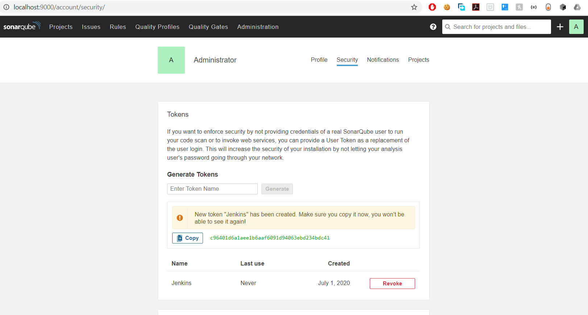
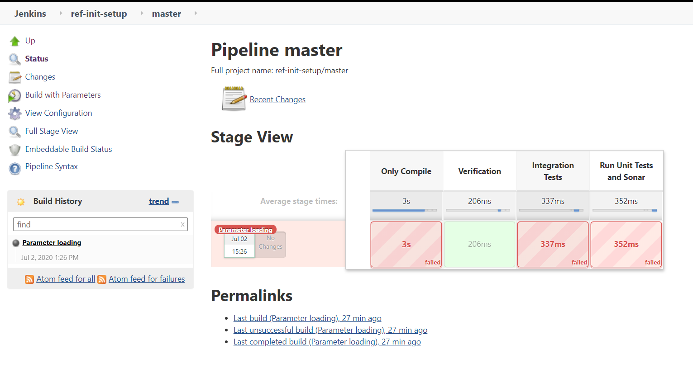
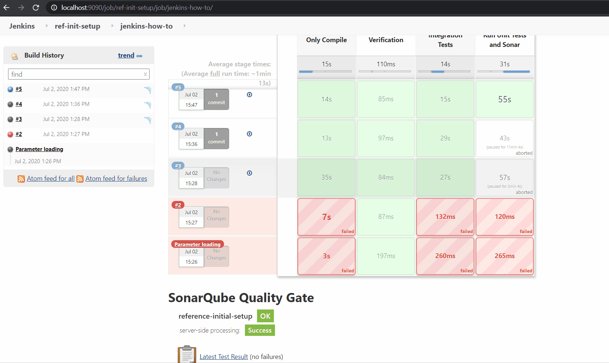

# Setup Local Jenkins
You need Docker on your machine. Then we can set up Jenkins and Sonar to build this project.

## Running Jenkins and Sonar
Go to 'jenkins' folder on the root of the project. Use this command to run Jenkins+Sonar
```shell script
docker-compose up -d
```
In order for Jenkins to be able to communicate with Sonar, we need to create an authentication token. To do this, go
to the [Sonar Tokens](http://localhost:9000/account/security/). The default username/password for Sonar is admin/admin. Under
"Generate Tokens" enter the name "Jenkins" and select "Generate". Select "Copy" and keep this token somewhere, we will need
 it on the Jenkins config.


Now we should config Sonar on Jenkins. Go to [New Credentials](http://localhost:9090/credentials/store/system/domain/_/newCredentials)
and create a Secret Text for Sonar with these properties and click OK:
```yaml
Kind: Secret text
Secret: THE_TOKEN_GENERATED_BY_SONAR
ID: sonar-token
```
Now go to [Configure Jenkins](http://localhost:9090/configure), look for "SonarQube servers". Click
on "Add SonarQube" and enter these properties Click Save on the bottom of the page:
```yaml
Name: sonar
Server URL: http://sonar:9000
Server authentication token: sonar-token
```
Configuration almost over. Click on [Create a job](http://localhost:9090/newJob). Use 
"spring-boot-with-angular" as the project name, select "Multibranch Pipeline", and press OK. For minimal
configuration, under "Branch Sources", select Add source "Git" and fill the properties and click on Save:
```yaml
Project Repository: https://github.com/amirmv2006/spring-boot-with-angular.git
```
This will start cloning the Git repository and will create a job for each branch. You can select 
the branch job and press build.
## Known Jenkins Issue
The Jenkins multibranch pipeline has problems when it comes to Parameterized builds, so the first
time the build is executed for each branch, it doesn't know yet about the parameters. To prevent 
wrong execution of jenkins jobs, we will fail the first jenkins job indicating 'Parameter loading'.



The other problem is, since sonar is configured to be running on name server 'sonar', when you
click on Sonar links from Jenkins, you browser will point to http://sonar:9000/... what you need to
do in this case is to just replace 'sonar' with 'localhost' and the the URL will become valid again.

